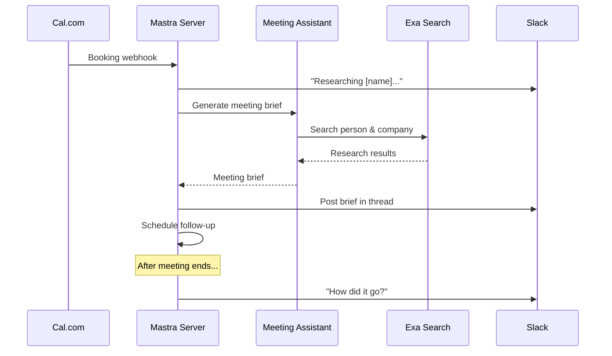
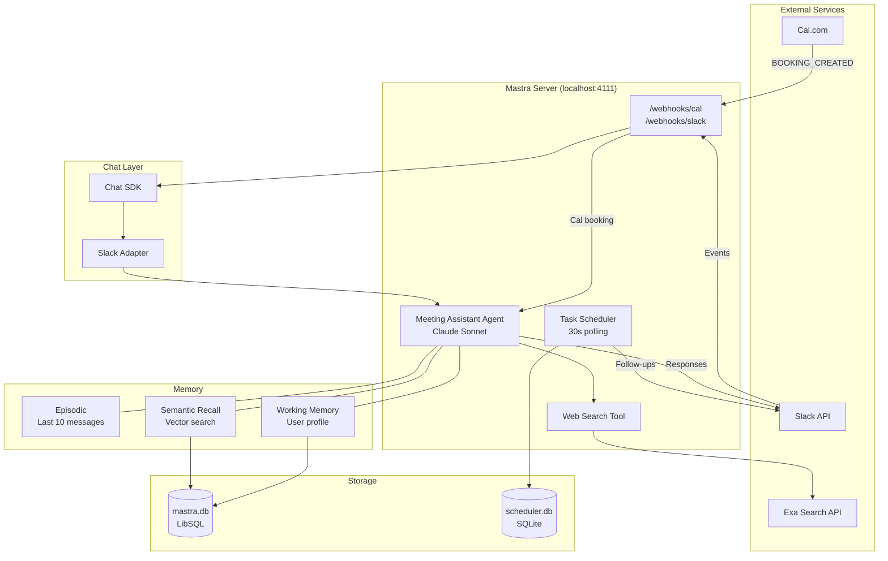
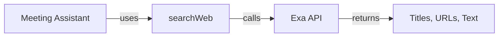
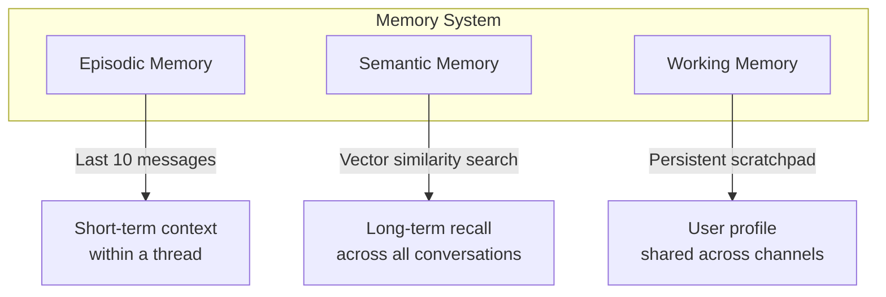
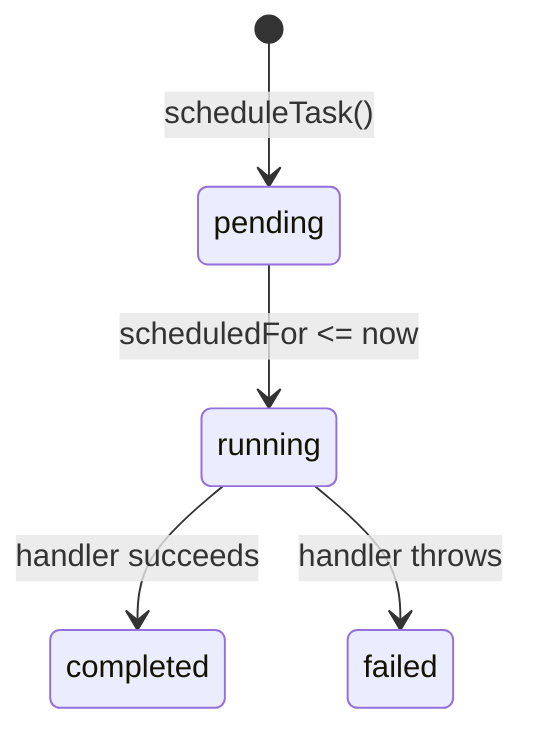

# Meeting Assistant

A personal AI assistant that preps you for every meeting — built with [Mastra](https://mastra.ai/), the TypeScript framework for AI agents. An agent that researches your meeting attendees, posts briefs to Slack, and schedules follow-ups — all automatically.

## What It Does

1. Someone books a call on [Cal.com](https://refer.cal.com/md-tehseen-khan-nb9o)*
2. The agent researches who they are using web search
3. A meeting brief gets posted to your Slack channel
4. You chat with the agent in-thread to ask follow-up questions
5. After the meeting ends, it reminds you to follow up
6. Over time, it learns your preferences through memory




## Architecture




### Agent + Tools

The core agent (`src/mastra/agents/meeting-assistant.ts`) is configured with instructions, a model, tools, and memory. Tools give the agent the ability to *do things* — in this case, search the web via the Exa API.




### Memory (Three Layers)

Mastra's memory system gives the agent context across conversations:




| Layer        | What it does                                                   | Scoped to     |
| ------------ | -------------------------------------------------------------- | ------------- |
| **Episodic** | Keeps the last 10 messages in context                          | Thread        |
| **Semantic** | Vector search over all past messages — finds topics by meaning | Global        |
| **Working**  | Persistent user profile the agent updates over time            | User (shared) |


### Webhooks

Two webhook endpoints handle external events:

- `**/webhooks/slack`** — Slack events (mentions, messages)
- `**/webhooks/cal`** — Cal.com booking creation

### Task Scheduling

A simple polling scheduler (`src/scheduler.ts`) handles time-delayed actions like post-meeting follow-ups. Tasks are stored in SQLite via Drizzle ORM and checked every 30 seconds.




### Slack Integration (Chat SDK)

The [Chat SDK](https://chat-sdk.dev/) provides a platform-agnostic interface for bot communication. The Slack adapter handles event subscriptions, threading, and typing indicators.

## Getting Started

### Prerequisites

- Node.js >= 22.13
- A Slack workspace where you can install apps
- API keys for OpenAI, Exa, and (optionally) Cal.com

### 1. Clone and install

```bash
git clone https://github.com/MdTehseenKhan/meeting-assistant.git
cd meeting-assistant
bun install
```

### 2. Set up environment variables

```bash
cp .env.example .env
```

Fill in your `.env`:


| Variable               | Description                    | Where to get it                                             |
| ---------------------- | ------------------------------ | ----------------------------------------------------------- |
| `OPENAI_API_KEY`       | OpenAI API key                 | [platform.openai.com](https://platform.openai.com/api-keys) |
| `SLACK_BOT_TOKEN`      | Slack bot token (`xoxb-...`)   | Slack app settings > OAuth                                  |
| `SLACK_SIGNING_SECRET` | Webhook signature verification | Slack app settings > Basic Information                      |
| `EXA_API_KEY`          | Web search API                 | [exa.ai](https://exa.ai/)                                   |
| `SLACK_CHANNEL_ID`     | Channel for meeting briefs     | Right-click channel in Slack > Copy link                    |


### 3. Create the Slack app

Go to [api.slack.com/apps](https://api.slack.com/apps) and create a new app **from manifest**. Paste the contents of `slack-app-manifest.yaml`, then update the URLs after setting up ngrok (next step).

Install the app to your workspace and copy the **Bot Token** and **Signing Secret** into your `.env`.

### 4. Expose your local server

The Slack and Cal.com webhooks need a public URL. Use [ngrok](https://ngrok.com/) to tunnel to your local server:

```bash
ngrok http 4111
```

Copy the `https://...ngrok-free.app` URL and update:

- **Slack app settings** > Event Subscriptions > Request URL: `https://YOUR_URL/webhooks/slack`
- **Slack app settings** > Interactivity > Request URL: `https://YOUR_URL/webhooks/slack`
- **[Cal.com](https://refer.cal.com/dgalarza-ucac)*** > Settings > Developer > Webhooks: `https://YOUR_URL/webhooks/cal` (event: Booking Created)

### 5. Initialize the database

```bash
npx drizzle-kit push
```

### 6. Start the dev server

```bash
bun dev
```

Mastra Studio is now running at [http://localhost:4111](http://localhost:4111). Mention your bot in Slack to start chatting, or create a Cal.com booking to trigger the full flow.

## Project Structure

```
src/
├── mastra/
│   ├── index.ts                 # Mastra config, webhooks, scheduler setup
│   ├── agents/
│   │   └── meeting-assistant.ts # Agent definition with memory + tools
│   └── tools/
│       └── research-tools.ts    # Exa web search tool
├── chat.ts                      # Slack bot via Chat SDK
├── scheduler.ts                 # Polling task scheduler
└── db/
    ├── index.ts                 # Drizzle database connection
    └── schema.ts                # scheduled_tasks table schema
```

## Scripts


| Command     | Description                             |
| ----------- | --------------------------------------- |
| `bun dev`   | Start Mastra dev server with hot reload |
| `bun build` | Build for production                    |
| `bun start` | Start production server                 |


## Learn More

- [Mastra Documentation](https://mastra.ai/docs/)
- [Mastra Memory](https://mastra.ai/docs/memory/overview)
- [Chat SDK](https://chat-sdk.dev/)
- [Exa API](https://docs.exa.ai/)

## Disclosure

*Some links in this README are affiliate links. If you sign up through them, I may earn a small commission at no extra cost to you.